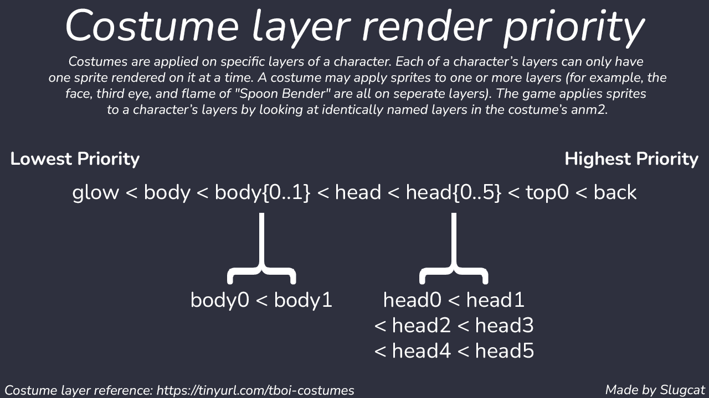

# Costume Templates
This repo contains easy to use costume references/templates for Repentance. [It's a fork of this repo](https://github.com/ddeeddii/isaac-costume-templates) with some structural changes.

# Contents
There are two major categories:

- Compact (the minimum amount of frames: body has just up and right movement directions, and head has all directions except left)
- Full (the maximum amount of frames: all possible movement directions, not necessary for some costumes)

Within these categories are some subcategories:

- Normal (a normal costume)
- Colored (applies a different sprite depending on the skin color of the character)
- Overlay (a costume with an animated overlay that is played on top of another animation)

As of now, there isn't an example anm2 for animations nor body overlays. Here are the animation names you'll need to use for those costumes:

Animated Animation Names:
- HeadRight_Idle
- HeadLeft_Idle
- HeadDown_Idle
- HeadUp_Idle
- WalkRight_Idle
- WalkLeft_Idle
- WalkDown_Idle
- WalkUp_Idle

Overlay Body Animation Names:
- WalkRight_Overlay
- WalkLeft_Overlay
- WalkDown_Overlay
- WalkUp_Overlay

Body overlays are never used in game and don't animate properly until you start moving. Body animations are only use by Dirty Mind, and Dirty Mind only uses the WalkDown_Idle animation.

## General
To use them, replace the correct texture in the corresponding anm2.

For example, when creating a head-only costume using a compact spritesheet, navigate to `compact > normal > compact_head.anm2`. Replace the original head spritesheet with the new one.

Note that some costumes may require altercations to suit your needs.

## Color costumes
Color costumes behave the same as regular costumes. They differ in the game.
Colored costumes automatically apply the correct texture for the corresponding skin color.

**When changing the file name, do not change the color part.**
A color part is whatever comes after the underscore, including the underscore.
For example, in `head_blue`, the color part is `_blue`.
Changing that will result in the color costume not applying correctly.

In order to mark a costume as a color costume, add `hasSkinAlt="true"` to the costume's entry in `costumes2.xml`.

## Animated / Overlay costumes
Change the spritesheet until you're satisfied.
When you're done, add `hasOverlay="true"` to the costume's entry in `costumes2.xml`.

# Additional resources

## Costume layer render priority infographic

## [Repentance costume layer, priority, and id reference](https://docs.google.com/spreadsheets/d/1NGa3IARRSvs5XF9lxbYWFnbI77xO1m2YYaKEoB6OyVI/edit?usp=sharing)
A spreadsheet of all costumes in Repentance, along with their priorities, ids, and layers they effect.